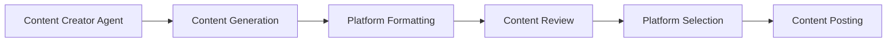
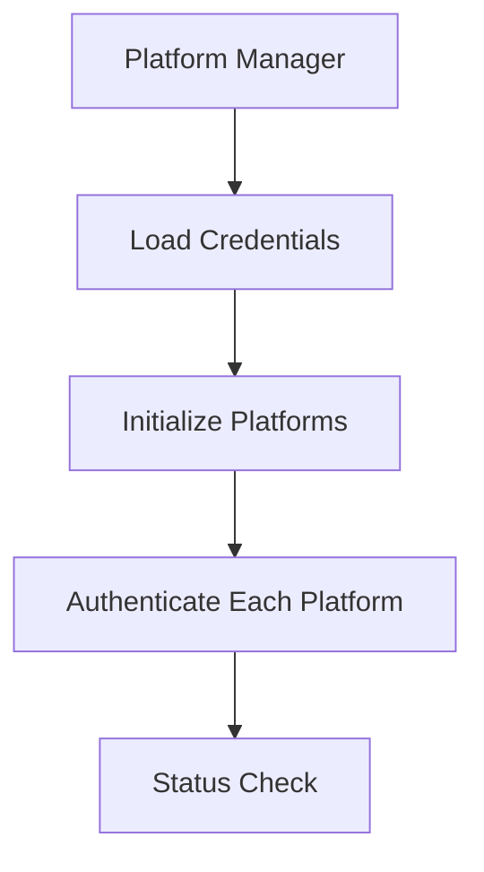
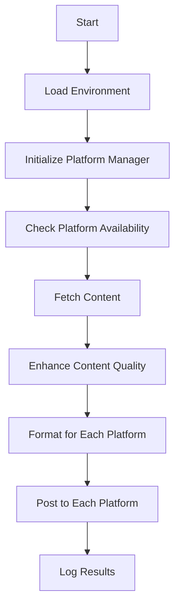

# Technical Documentation - Autonomous Social Media Curator

## Table of Contents
1. [System Architecture](#system-architecture)
2. [Core Components](#core-components)
3. [Data Flow](#data-flow)
4. [Integration Details](#integration-details)
5. [Error Handling](#error-handling)
6. [Configuration](#configuration)
7. [File Structure & Purpose](#file-structure--purpose)
8. [Tool Flows](#tool-flows)
9. [Command Reference](#command-reference)

## System Architecture

### Overview
The system uses a modular architecture with the following key components:

```
social_media_bot/
├── agents/          # AI agents using CrewAI
├── api/             # API endpoints and interfaces
├── analytics/       # Performance analytics
├── config/          # Configuration modules
├── database/        # Database management
├── models/          # Data models
├── platforms/       # Platform implementations
├── scheduler/       # Content scheduling
├── services/        # Backend services
├── tools/           # Utility tools
├── utils/           # Helper utilities
├── __init__.py      # Package initialization
├── main.py          # Main application entry
├── tasks.py         # Task definitions
└── multi_platform_post.py  # Platform posting utility
```

### Core Technologies
- **CrewAI**: Agent orchestration framework
- **Deepseek LLM**: Content generation and analysis
- **SQLAlchemy**: Database ORM
- **Platform APIs**: Dev.to, Mastodon, and Reddit integration
- **NewsAPI**: News content gathering

## Core Components

### 1. Platform Management
```python
class PlatformManager:
    """
    Manages platform initialization, authentication, and posting
    Location: social_media_bot/platforms/manager.py
    """
    def __init__(self):
        self.platforms: Dict[Platform, SocialMediaPlatform] = {}
        self._initialize_platforms()
```

Key Features:
- Dynamic platform initialization
- Centralized authentication management
- Unified posting interface
- Platform status monitoring

### 2. Content Tools
```python
class ContentTools(BaseTool):
    """
    Handles content generation and posting
    Location: social_media_bot/tools/content_tools.py
    """
    _platform_manager: PlatformManager = PrivateAttr()
```

Responsibilities:
- Content generation
- Platform-specific formatting
- Posting coordination
- Result tracking

### 3. Platform Implementations

#### Dev.to Platform
```python
class DevToAPI(SocialMediaPlatform):
    """
    Dev.to specific implementation
    Location: social_media_bot/platforms/devto.py
    """
```
Features:
- API authentication
- Article posting with tags
- Status monitoring
- Error handling

#### Mastodon Platform
```python
class MastodonAPI(SocialMediaPlatform):
    """
    Mastodon specific implementation
    Location: social_media_bot/platforms/mastodon.py
    """
```
Features:
- OAuth authentication
- Status posting
- Media handling
- Visibility controls

#### Reddit Platform
```python
class RedditAPI(SocialMediaPlatform):
    """
    Reddit specific implementation
    Location: social_media_bot/platforms/reddit.py
    """
```
Features:
- OAuth authentication
- Subreddit posting
- Content formatting
- Rate limiting

### 4. Database Integration
```python
class DatabaseManager:
    """
    Database operations management
    Location: social_media_bot/database/db_manager.py
    """
```
Features:
- SQLite/PostgreSQL integration
- Schema management
- Transaction handling
- Performance optimization

## Data Flow

### 1. Content Creation Flow


### 2. Platform Authentication Flow


### 3. Multi-Platform Posting Flow


## Integration Details

### 1. Platform Integration

#### Dev.to API Integration
```python
def post_content(self, content: str, **kwargs) -> Dict[str, Any]:
    """
    Posts content to Dev.to
    Required kwargs:
    - title: str
    - tags: List[str]
    """
```

#### Mastodon API Integration
```python
def post_content(self, content: str, **kwargs) -> Dict[str, Any]:
    """
    Posts content to Mastodon
    Optional kwargs:
    - visibility: str
    - media_ids: List[str]
    """
```

#### Reddit API Integration
```python
def post_content(self, content: str, **kwargs) -> Dict[str, Any]:
    """
    Posts content to Reddit
    Required kwargs:
    - title: str
    - subreddit: str
    Optional kwargs:
    - flair: str
    """
```

### 2. Database Schema
```sql
-- Post History Table
CREATE TABLE post_history (
    id SERIAL PRIMARY KEY,
    platform VARCHAR NOT NULL,
    content TEXT NOT NULL,
    posted_at TIMESTAMP,
    status VARCHAR,
    performance_metrics JSONB
);

-- Content Source Table
CREATE TABLE content_source (
    id SERIAL PRIMARY KEY,
    url VARCHAR NOT NULL,
    title VARCHAR,
    source_type VARCHAR,
    retrieved_at TIMESTAMP
);

-- Safety Log Table
CREATE TABLE safety_log (
    id SERIAL PRIMARY KEY,
    check_type VARCHAR,
    content_id INTEGER,
    status VARCHAR,
    issues TEXT,
    checked_at TIMESTAMP
);
```

## Error Handling

### 1. Platform-Level Error Handling
```python
try:
    result = platform.post_content(content, **kwargs)
except PlatformError as e:
    logger.error(f"Platform error: {str(e)}")
    return {"success": False, "error": str(e)}
```

### 2. Retry Mechanism
```python
def _post_with_retry(self, platform: Platform, content: str, **kwargs):
    for attempt in range(self.max_retries):
        try:
            result = self.platform_manager.post_to_platform(
                platform=platform,
                content=content,
                **kwargs
            )
            if result.get("success"):
                return result
        except Exception as e:
            logger.error(f"Attempt {attempt + 1} failed: {str(e)}")
            time.sleep(2 ** attempt)  # Exponential backoff
```

### 3. Database Transaction Management
```python
def create_post(self, post_data):
    """Create a new post with transaction handling"""
    try:
        session = self.Session()
        post = Post(**post_data)
        session.add(post)
        session.commit()
        return post
    except Exception as e:
        session.rollback()
        logger.error(f"Database error: {str(e)}")
        raise
    finally:
        session.close()
```

## Configuration

### 1. Environment Variables
```python
# Required environment variables
DEEPSEEK_API_KEY=str               # For enhanced content processing
DEVTO_API_KEY=str                  # For Dev.to posting
DEVTO_ENABLED=bool                 # Enable/disable Dev.to
MASTODON_ACCESS_TOKEN=str          # For Mastodon posting
MASTODON_API_BASE_URL=str          # Mastodon instance URL
MASTODON_ENABLED=bool              # Enable/disable Mastodon
REDDIT_CLIENT_ID=str               # For Reddit posting
REDDIT_CLIENT_SECRET=str           # For Reddit posting
REDDIT_USERNAME=str                # For Reddit posting
REDDIT_PASSWORD=str                # For Reddit posting
REDDIT_USER_AGENT=str              # For Reddit posting
REDDIT_ENABLED=bool                # Enable/disable Reddit
DATABASE_URL=str                   # Database connection string
NEWS_API_KEY=str                   # For news content gathering
```

### 2. Platform Configuration
```python
class PlatformConfig:
    @staticmethod
    def get_enabled_platforms():
        """Returns list of platforms with valid credentials"""
        enabled = []
        
        if os.getenv('DEVTO_API_KEY') and os.getenv('DEVTO_ENABLED', 'false').lower() == 'true':
            enabled.append(Platform.DEVTO)
            
        if os.getenv('MASTODON_ACCESS_TOKEN') and os.getenv('MASTODON_ENABLED', 'false').lower() == 'true':
            enabled.append(Platform.MASTODON)
            
        if os.getenv('REDDIT_CLIENT_ID') and os.getenv('REDDIT_CLIENT_SECRET') and os.getenv('REDDIT_ENABLED', 'false').lower() == 'true':
            enabled.append(Platform.REDDIT)
            
        return enabled
```

## File Structure & Purpose

Here's a comprehensive breakdown of all the files in the project and their purpose:

### Core Files

1. **social_media_bot/main.py**
   - Main entry point for the application
   - Initializes database, platform manager, and agents
   - Sets up command-line argument parsing
   - Handles the main execution flow

2. **social_media_bot/agents.py**
   - Defines all AI agents using the CrewAI framework
   - Contains agent creation functions with specialized roles
   - Sets up agent tools and contexts
   - Handles agent interactions

3. **social_media_bot/multi_platform_post.py**
   - Utility for posting to multiple social media platforms
   - Can be run directly from command line
   - Supports platform selection and content enhancement options
   - Handles the full posting workflow

4. **social_media_bot/tasks.py**
   - Defines tasks for CrewAI agents
   - Sets up task descriptions, goals, and expected outputs
   - Manages task dependencies

### Platform Implementation Files

5. **social_media_bot/models/platform.py**
   - Defines the Platform enum with supported platforms
   - Used throughout the codebase for platform identification

6. **social_media_bot/platforms/base.py**
   - Base class for all platform implementations
   - Defines the interface that all platforms must implement
   - Contains common platform functionality

7. **social_media_bot/platforms/manager.py**
   - Manages all platform instances
   - Handles platform initialization, authentication, and status checks
   - Provides a unified interface for posting to any platform

8. **social_media_bot/platforms/platform_factory.py**
   - Factory pattern for creating platform instances
   - Maps Platform enum values to concrete implementations
   - Handles enabled/disabled state

9. **social_media_bot/platforms/devto.py**
   - Dev.to platform implementation
   - Handles API authentication and article posting

10. **social_media_bot/platforms/mastodon.py**
    - Mastodon platform implementation
    - Handles OAuth authentication and status posting

11. **social_media_bot/platforms/reddit.py**
    - Reddit platform implementation
    - Handles OAuth authentication and subreddit posting

### Configuration Files

12. **social_media_bot/config/platforms.py**
    - Platform-specific configuration
    - Determines which platforms are enabled

13. **social_media_bot/config/llm_config.py**
    - LLM configuration for CrewAI agents
    - Sets up the language model parameters

14. **social_media_bot/config/feeds.py**
    - Configures RSS feeds for content gathering
    - Contains feed URLs and categories

### Database Files

15. **social_media_bot/database/db_manager.py**
    - Central database management
    - Provides methods for database operations
    - Handles transactions and error management

16. **social_media_bot/database/init_db.py**
    - Database initialization
    - Creates tables and sets up initial data

17. **social_media_bot/database/models.py**
    - SQLAlchemy ORM models
    - Defines database schema

### Tool Files

18. **social_media_bot/tools/content_tools.py**
    - Tools for content generation and manipulation
    - Handles content formatting and optimization

19. **social_media_bot/tools/news_tools.py**
    - Tools for gathering news content
    - Integrates with NewsAPI and RSS feeds

20. **social_media_bot/tools/safety_tools.py**
    - Tools for content safety and compliance
    - Handles content moderation and duplicate detection

21. **social_media_bot/tools/database_tools.py**
    - Tools for database operations
    - Provides agent-friendly database access

22. **social_media_bot/tools/content_quality.py**
    - Tools for enhancing content quality
    - Uses Deepseek LLM for content improvement

23. **social_media_bot/tools/content_strategies.py**
    - Strategies for content creation
    - Implements different content approaches (e.g., tech news)

### Utility Files

24. **social_media_bot/utils/rate_limiter.py**
    - Rate limiting implementation
    - Prevents API abuse

25. **post_dev_blog.py**
    - Standalone script for posting to Dev.to
    - Creates enhanced blog posts using DeepSeek API

26. **test_db.py**
    - Database testing utility
    - Verifies database connectivity and structure

27. **cleanup_db.py**
    - Database maintenance utility
    - Removes old records

## Tool Flows

### 1. News Collection Flow

1. **Start**: Entry point from main.py or direct call to multi_platform_post.py
2. **Initialize NewsAPI**: Set up NewsAPI with API key
3. **Fetch News**: Get latest tech news articles
4. **Filter Content**: Select relevant content based on topics
5. **Process Articles**: Extract full article content
6. **Enhance Content**: Improve article quality with DeepSeek LLM
7. **Store in Database**: Save processed content for further use

### 2. Content Posting Flow

1. **Platform Selection**: Choose which platforms to post to
2. **Authentication**: Authenticate with each platform
3. **Content Formatting**: Format content for each platform
4. **Safety Check**: Verify content safety and compliance
5. **Rate Limit Check**: Ensure posting doesn't exceed limits
6. **Post Content**: Send content to each platform
7. **Record Result**: Store posting results in database
8. **Error Handling**: Handle any posting failures

### 3. Database Operation Flow

1. **Connection**: Establish database connection
2. **Transaction**: Begin database transaction
3. **Operation**: Perform database operation (create/read/update/delete)
4. **Validation**: Validate operation results
5. **Commit/Rollback**: Commit on success, rollback on failure
6. **Cleanup**: Close connection and handle resources

## Command Reference

### Running the Main Application

```bash
python social_media_bot/main.py [--strategy default|tech_news] [--platforms platform1,platform2] [--force]
```

Options:
- `--strategy`: Content strategy to use (default or tech_news)
- `--platforms`: Specific platforms to post to (comma-separated)
- `--force`: Force content generation even if APIs are rate-limited

### Multi-Platform Posting

```bash
python social_media_bot/multi_platform_post.py [--platforms platform1,platform2] [--no-enhance]
```

Options:
- `--platforms`: Specific platforms to post to (comma-separated)
- `--no-enhance`: Skip content enhancement

### Dev.to Blog Posting

```bash
python post_dev_blog.py
```

### Database Management

```bash
python test_db.py    # Test database connection
python cleanup_db.py # Clean up old database records
```

### Checking Platform Status

```bash
python -c "from social_media_bot.platforms.manager import PlatformManager; pm = PlatformManager(); print(pm.check_all_statuses())"
```

## Security Considerations

1. **API Key Management**
   - Keys stored in environment variables
   - No hardcoded credentials
   - Secure credential validation

2. **Rate Limiting**
   - Platform-specific rate limits
   - Exponential backoff
   - Request tracking

3. **Error Prevention**
   - Input validation
   - Content safety checks
   - Platform status verification

## Testing

### 1. Database Testing
```python
def test_database_persistence():
    """
    Tests database operations and persistence
    Location: test_db.py
    """
```

### 2. Platform Testing
```python
def test_reddit_post():
    """
    Tests Reddit authentication and posting
    Location: social_media_bot/test_reddit_post.py
    """
```

### 3. Content Quality Testing
```python
def test_quality():
    """
    Tests content quality enhancement
    Location: test_quality.py
    """
```

## Deployment

### 1. Requirements
- Python 3.8+
- Database (SQLite by default, PostgreSQL optional)
- Platform API credentials
- Deepseek API access

### 2. Setup Process
1. Database initialization
2. Environment configuration
3. Platform authentication
4. System startup

## Monitoring and Logging

### 1. Logging System
```python
logging.basicConfig(level=logging.INFO)
logger = logging.getLogger(__name__)
```

### 2. Performance Tracking
- Post success rates
- Platform response times
- Error frequency
- Content engagement 